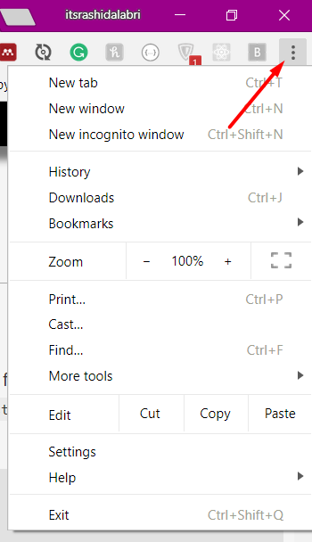
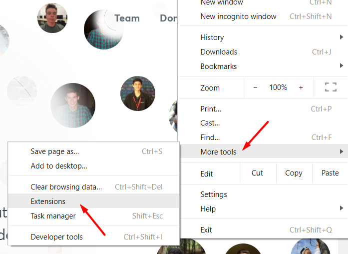
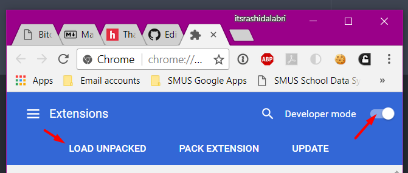
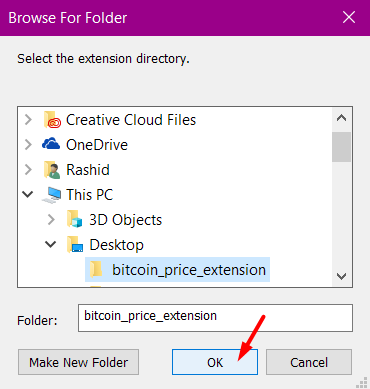

# Bitcoin Chrome Extension
Hello there, hacker!

With Bitcoin and other crypto-currencies booming like never before, it's very important that young hackers like you get involved in this revolution. Getting involved can take many forms, from investing, to mining, to even creating a simple chrome extension.


> If you have no idea what Bitcoin is, we suggest you watch this [short video that explains how Bitcoin works](1).

In this tutorial, we're going to build a Chrome extension that displays live Bitcoin prices using the [Blockchain API](2).

We will be introducing you to the basics of building Chrome extensions and jQuery—a javascript library which you should have been exposed to if you've done the ["That Was Easy"](3) workshop. It is highly recommended that you go through that workshop and the ["Personal Website"](4) workshop, as some basic HTML, CSS, Javascript and jQuery knowledge is required.

##### Pre-requisites
* Basic HTML knowedge
* Some familiarity with Javascript and the jQuery library
* The Google Chrome browser
* A text editor (we recommend [Atom](5))

By the end of this tutorial, you will learn the basic structure of a Chrome extension, how to run and test a Chrome extension, how to fetch data from APIs in Javascript, and how to use the `change` event in jQuery.

**Table of Contents**
- [Part I - Setting Up](#part-i-setting-up)

## Part I: Setting up
### Creating our extension folder
Every chrome extension is contained in a folder. To start, create a folder on your machine called `bitcoin_price_extension`. After that, we need to create a `manifest.json` inside your folder. Copy and paste the following into the file:
```
{
  "manifest_version": 2,
  "name": "Bitcoin Price Checker",
  "version": "1.0"
}
```
We will explain later what each of the values mean. Right now, we have built the most basic version of a chrome extension that one can run.
### Enabling developer mode
In order for us to be able to run and test our chrome extension, we must enable the developer mode in Chrome. To do that, open your chrome menu by clicking the three vertical dots in the top-right corner.



Then, click on `More tools`, followed by `Extension`.



You will be taken to the Chrome extensions page. In the top-right corner, set the `Developer Mode` switch to on. If it has been turned on, you should see a menu pop up with `Load Unpacked`. Click that button.



You should see a folder selection prompt show up. Select your extension folder.



You should now see your extension on top of the extensions list.

[1]: https://www.youtube.com/watch?v=Gc2en3nHxA4
[2]: https://blockchain.info/api
[3]: https://hackclub.com/workshops/that_was_easy
[4]: https://hackclub.com/workshops/personal_website
[5]: https://atom.io/
